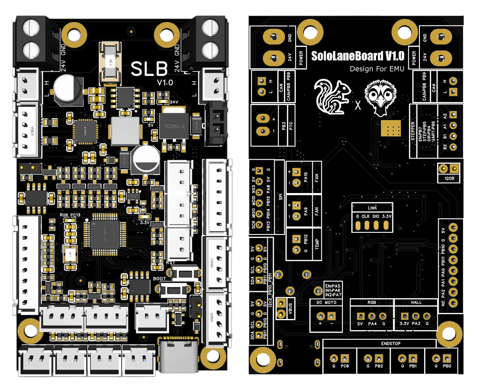
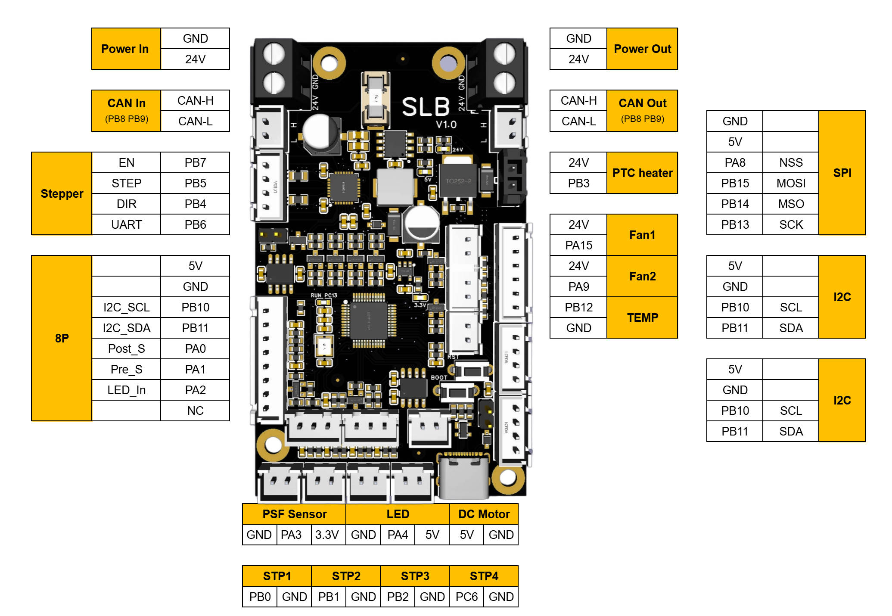
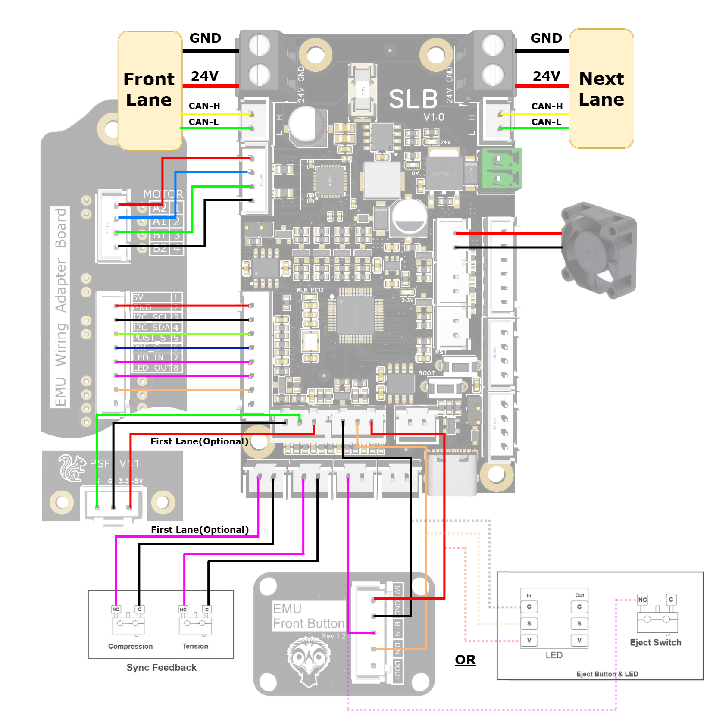
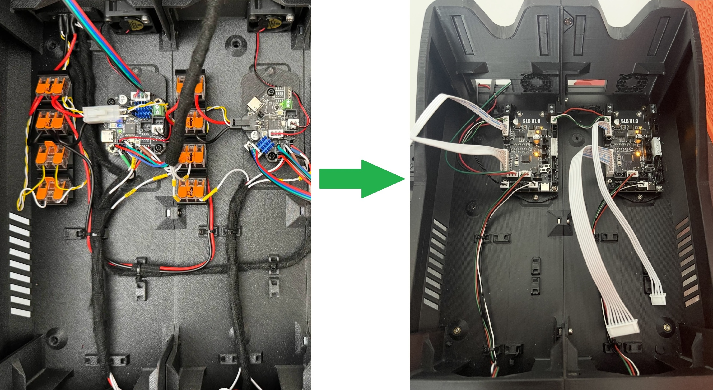
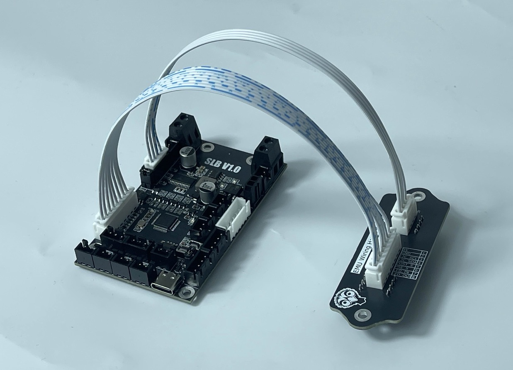
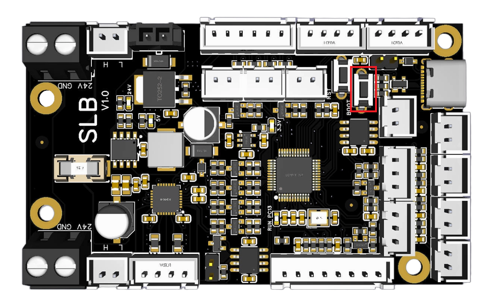
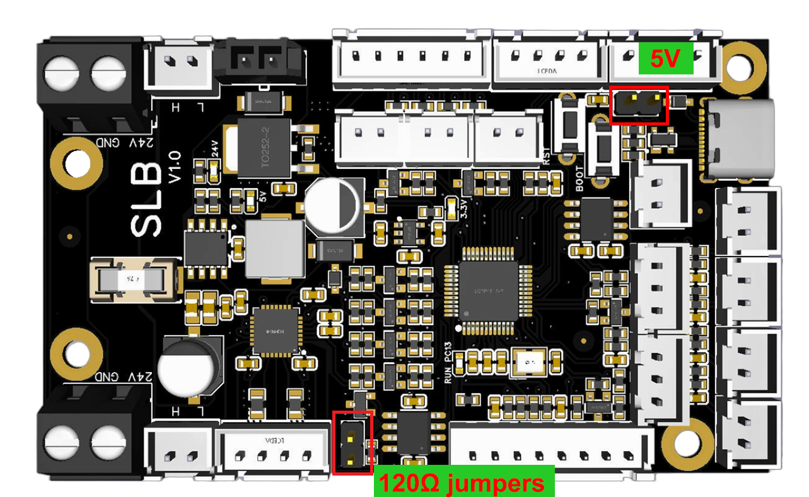
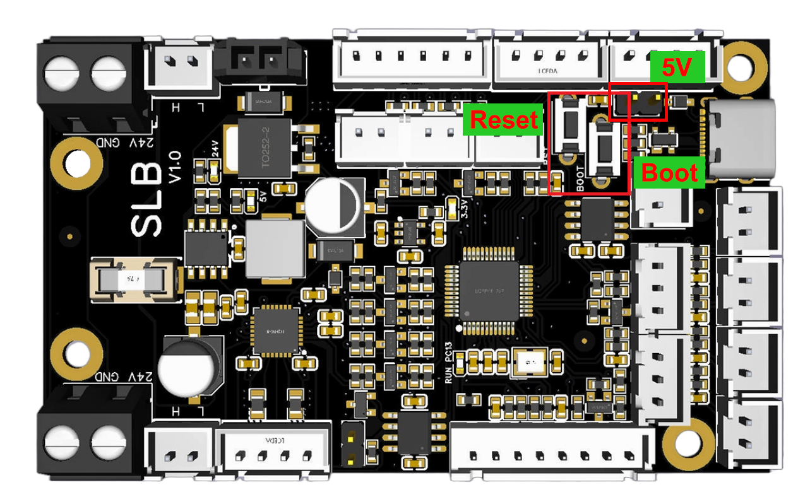

# SLB-Board-For-EMU


## Table of Contents

- [Introduction](#introduction)
- [1. PIN Diagram](#1-pin-diagram)
- [2. EMU Wiring Diagram](#2-emu-wiring-diagram)
- [3. EMU Configuration](#3-emu-configuration)
- [4. Flashing Guide](#4-flashing-guide)
  - [4.1. Flashing Katapult (Optional)](#41-flashing-katapult-optional)
  - [4.2. Compiling Klipper Firmware](#42-compiling-klipper-firmware)
  - [4.3. Updating Firmware via Katapult](#43-updating-firmware-via-katapult)
  - [4.4. Updating Firmware via DFU](#44-updating-firmware-via-dfu)

---

## Introduction
**SLB (Solo Lane Board)** is a control board designed specifically for **EMU**-style MMU systems, where each lane is driven by an independent controller board.  

No WAGO connectors and no LED daisy-chaining. Supports power and CANBUS cascading, and is compatible with the EMU_Hatch_Board, greatly simplifying EMU wiring.


This motherboard is factory-produced using high-quality electronic components with SMT assembly, ensuring reliable and consistent quality.



**It has the following features:**

- **Main Chip**: STM32G0B1CBT6 MCU
- **1 x Onboard TMC2209 stepper driver** operating in UART mode, with 5V logic circuitry.
- **1x 8-pin XH2.54 connector** is provided for direct connection to the **EMU Hatch Board**.
- **Dual power connectors and dual CAN interfaces** for convenient daisy-chaining.
- **2 × Neopixel RGB interfaces**, one of which is integrated into the 8-pin XH2.54 connector.
- **6 × I/O connectors**, two of which are integrated into the 8-pin XH2.54 connector.
- **3 × I2C interfaces**, one of which is integrated into the 8-pin XH2.54 connector.
- **2 × 24V fans** with adjustable speed control
- **1 × PTC heating interface**, 5A max
- **1 × NTC temperature sensor** interface for temperature monitoring
- **1 x Hall interfaces** for PSF Sensor
- **1 x 5V Brushed DC motor drivers** with forward/reverse support, En pin, and sleep mode
- **1 x SPI interfaces**

  

## 1. PIN Diagram




## 2. EMU Wiring Diagram








For other detailed wiring information, please refer to the official EMU documentation:

https://github.com/DW-Tas/EMU/tree/main/docs/assembly_wiring


## 3. EMU Configuration

**mmu.cfg**

``` python
[mcu mmu0]
canbus_uuid: 


[board_pins mmu0]
mcu: mmu0 
aliases:
    MMU_GEAR_UART=PB6,
    MMU_GEAR_STEP=PB5,
    MMU_GEAR_DIR=PB4,
    MMU_GEAR_ENABLE=PB7,
    MMU_GEAR_DIAG=,

    MMU_NEOPIXEL_Box=PA2,
    MMU_NEOPIXEL_Front=PA4,

    MMU_PRE_GATE=PA1,
    MMU_POST_GEAR=PA0,

    # MMU_TENSION=PB1, # First lane has the sync feedback sensor attached to it!
    # MMU_COMPRESSION=PB0, # First lane has the sync feedback sensor attached to it!
    MMU_TH=PA3, # First lane has the PFS sensor attached to it!

    MMU_FAN=PA15,
    EJECT_BUTTON=PC6,

......
[mcu mmu1]    
.......    
......
[mcu mmu2]    
.......    
.......
.......    
```


**MMU NEOPIXEL LED SUPPORT (mmu_hardware.cfg):**

``` python
# MMU NEOPIXEL LED SUPPORT ------------------------------------------------------------------------------------

[neopixel mmu0_led0]   # Lane0
pin: mmu0:MMU_NEOPIXEL_Box
chain_count: 1			
color_order: GRBW		# Set based on your particular neopixel specification

[neopixel mmu0_led1]
pin: mmu0:MMU_NEOPIXEL_Front
chain_count: 1			
color_order: GRBW		# Set based on your particular neopixel specification

[neopixel mmu1_led0]   # Lane1
pin: mmu1:MMU_NEOPIXEL_Box
chain_count: 1			
color_order: GRBW		# Set based on your particular neopixel specification

[neopixel mmu1_led1]
pin: mmu1:MMU_NEOPIXEL_Front
chain_count: 1			
color_order: GRBW		# Set based on your particular neopixel specification

.................
.................

# MMU LED EFFECT SEGMENTS ----------------------------------------------------------------------------------------------

[mmu_leds unit0]
exit_leds:   neopixel:mmu0_led1 (1)
             neopixel:mmu1_led1 (1)# First, third, fifth LED and so forth.
             .....
entry_leds:  neopixel:mmu0_led0 (1)
             neopixel:mmu1_led0 (1)# First, third, fifth LED and so forth.
             .....
logo_leds:    
frame_rate: 24

enabled: True                           # LEDs are enabled at startup
animation: True                         # Use led-animation-effects
exit_effect: gate_status                # gate_status in the eject buttons
entry_effect: filament_color            # filament_color in the dry box LED

status_effect: off                      # no status LED is on the unit
logo_effect: (0, 0, 0)                  # no Logo LED is on the unit
white_light: (1, 1, 1)                  # RGB color for static white light
black_light: (1, 1, 1)                  # RGB color used to represent "black" filament
empty_light: (0.0, 0.0, 0.0)            # Empty gate has eject button "off"

effect_loading:            mmu_blue_clockwise_slow, (0, 0, 0.4)
effect_loading_extruder:   mmu_blue_clockwise_fast, (0, 0, 1)
effect_unloading:          mmu_blue_anticlock_slow, (0, 0, 0.4)
effect_unloading_extruder: mmu_blue_anticlock_fast, (0, 0, 1)
effect_heating:            mmu_breathing_red,       (0.3, 0, 0)
effect_selecting:          mmu_white_fast,          (0.2, 0.2, 0.2)
effect_checking:           mmu_white_fast,          (0.8, 0.8, 0.8)
effect_initialized:        mmu_rainbow,             (0.5, 0.2, 0)
effect_error:              mmu_strobe,              (1, 0, 0)
effect_complete:           mmu_sparkle,             (0.3, 0.3, 0.3)
effect_gate_selected:      mmu_static_blue,         (0, 0, 1)
effect_gate_available:     mmu_static_white_dim,    (0.3, 0.3, 0.3)
effect_gate_available_sel: mmu_ready_white,         (0.75, 0.75, 0.75)
effect_gate_unknown:       mmu_static_orange,       (0.5, 0.2, 0)
effect_gate_unknown_sel:   mmu_ready_orange,        (0.75, 0.3, 0)
effect_gate_empty:         mmu_static_black,        (0, 0, 0)
effect_gate_empty_sel:     mmu_ready_red,           (0.2, 0, 0)
```


 **Temperature and humidity sensor definitions:**

```python
[temperature_sensor Lane_N]
sensor_type: AHT2X
i2c_address: 56
i2c_mcu: mmu0  # mmu0=First lane, mmu1=second lane etc.
i2c_bus: i2c2_PB10_PB11

[temperature_sensor Lane_N]
sensor_type: BME280
i2c_address: 118
i2c_mcu: mmu0  # mmu0=First lane, mmu1=second lane etc.
i2c_bus: i2c2_PB10_PB11
```


For other related settings, please refer to the EMU Wiki documentation.

https://github.com/DW-Tas/EMU/blob/main/docs/software_setup/02-happy-hare-setup.md


## 4. Flashing Guide

### 4.1 Flashing Katapult (Optional)

Users who only use a CAN connection and want the convenience of quick firmware updates by pressing the Reset button can choose to flash Katapult (formerly known as Canboot).

Katapult is not mandatory, regardless of whether you use a CAN or USB connection.

```bash
# Go to the home directory
cd ~
 
# Download katapult (skip if you already have it)
git clone https://github.com/Arksine/katapult
 
# Enter the katapult directory
cd katapult
```


```bash
# Clean the previous build
make clean
 
# Modify the build configuration, fill in the parameters as shown in the image below
make menuconfig
 
# After verifying the settings, press q to exit, select y, then type make to start compiling
make
```


> [!TIP]
> The speed can be set according to your needs, 1000000 is recommended.


After compilation, katapult.bin will be generated in the ~/katapult/out folder.


**Entering DFU Mode**

Use a jumper to short the 5V USB pins. After shorting, you can power the board via USB for flashing. 

> [!TIP]
> Remember to remove the jumper after flashing is complete.  

If you are using 24V to power the board, you do not need to short the jumper, but you can only use Method 2 below to enter DFU mode.



- **Method 1 to enter DFU:** With the board completely powered off, press and hold the Boot button, connect the board to the host computer with a Type-C cable, then release the Boot button.

- **Method 2 to enter DFU:** If the board is powered on, connect it to the host computer with a Type-C cable, then press and hold the Boot button, press and release the Reset button, release the Reset button, and finally release the Boot button.

Then use the lsusb command to check if a DFU device is present.


```bash
lsusb
```


Use the following command to flash the board:

```bash
make flash FLASH_DEVICE=0483:df11
```


After flashing is complete, please unplug the USB cable and connect the CAN signal cable and 24V power supply.

> [!NOTE]
> 1: Remember to remove the 5V USB jumper.  
> 2: If you have multiple CAN devices, you only need to short the 120-ohm resistor on one device. It is best to short the 120-ohm resistor on the mainboard at the end of the chain.  
> 3: Pay close attention to the wiring order of 24V, GND, CAN-H, and CAN-L. Double-check carefully. Incorrect wiring may cause the mainboard to burn out, and you will be responsible for the consequences.  




Use the following command to check the CAN UUID. 
> [!TIP]
> You may need to quickly double-press the reset button to enter the bootloader.

```bash
~/klippy-env/bin/python ~/klipper/scripts/canbus_query.py can0
```


### 4.2 Compiling Klipper Firmware

SSH into your host machine.

```bash
# cd to the klipper directory
cd ~/klipper
 
# Clean the previous build
make clean
 
# Configure the build parameters [refer to the image below]
make menuconfig
```


Set the build parameters according to the protocol you need to use.


```bash
# If not using Katapult
Bootloader offset (No bootloader) --->
 
# If using Katapult
Bootloader offset (8KiB bootloader) --->
 
# If using USB communication via Type-C
Communication interface (USB (on PA11/PA12)) --->
 
# If using CANBus communication
Communication interface (CAN bus (on PD0/PD1)) --->
 (1000000) CAN bus speed
```

Press `q` to exit, and `y` to save.


Enter the make command to start compiling.

```bash
make
```


### 4.3 Updating Firmware via Katapult

Connect the CAN signal cable and 24V power supply.

> [!NOTE]
> 1: Remember to remove the 5V USB jumper.  
> 2: If you have multiple CAN devices, you only need to short the 120-ohm resistor on one device.  
> 3: Pay close attention to the wiring order of 24V, GND, CAN-H, and CAN-L. Double-check carefully. Incorrect wiring may cause the mainboard to burn out, and you will be responsible for the consequences.  


Then use the following command to check the UUID:

```bash
~/klippy-env/bin/python ~/klipper/scripts/canbus_query.py can0
```


Use the following command to flash in CAN mode:

```bash
cd ~/katapult/scripts
 
python3 flashtool.py -i can0 -f ~/klipper/out/klipper.bin -u your_uuid_here
```


Then continue to use the previous command to check the CAN information.


> [!TIP]
> To upgrade the CAN firmware in the future, repeat this process. When compiling the Katapult firmware earlier, we set it to enter Katapult mode by double-pressing the reset button. 
> In practice, you can also directly enter the flashing command, and the board will automatically restart and enter Katapult.  

### 4.4 Updating Firmware via DFU

1: Enter DFU mode.

Use a jumper to short the 5V USB pins. After shorting, you can power the board via USB for flashing. 

> [!TIP]
> Remember to remove the jumper after flashing is complete.

If you are using 24V to power the board, you do not need to short the jumper, but you can only use Method 2 below to enter DFU mode.




- Method 1 to enter DFU: With the board completely powered off, press and hold the Boot button, connect the board to the host computer with a Type-C cable, then release the Boot button.

- Method 2 to enter DFU: If the board is powered on, connect it to the host computer with a Type-C cable, then press and hold the Boot button, press and release the Reset button, release the Reset button, and finally release the Boot button.

2: In SSH, type lsusb to check if a DFU device appears. Normally, a DFU device should appear.

If no DFU device appears, repeat the operation.


3: In SSH, enter:

```bash
# Make sure you are in the klipper directory
cd ~/klipper
 
# 0483:df11 is the ID found with lsusb earlier
# If it says make not found, install it with sudo apt install dfu-util -y
 
make flash FLASH_DEVICE=0483:df11
```

The flashing process will then begin [you may need to enter your password]. Wait for the progress bar to complete. When "successfully" appears, it means the flashing was successful.

You can ignore any errors that appear after "successfully".


Flashing is complete.

4: **Get the serial ID**

Unplug and replug the USB data cable, use lsusb to check if there is an stm32f446 device.

Use the following command to check the device's serial ID:

```bash
ls /dev/serial/by-id/
```


The serial ID for this device is:

```bash
serial: /dev/serial/by-id/usb-Klipper_stm32g0b1xx_20003A00025030544E383020-if00
```

> [!TIP]
> For later use, please remove the 5V USB jumper and connect 24V power to the CAN interface.


